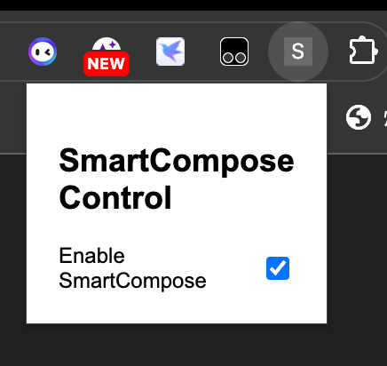
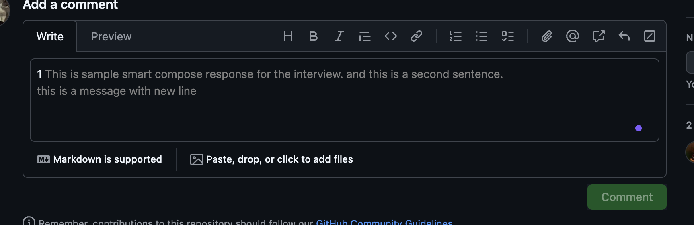

# SmartCompose Chrome 扩展

## 概述

**SmartCompose** 是一款 Chrome 扩展，旨在通过将 `<textarea>` 元素或可编辑的 `<div>` 元素转换为有输入建议的可编辑的 `<div>` 元素来增强文本输入区域的功能。这允许用户拥有更灵活的文本编辑能力，包括实时建议和更好的格式选项。

## 特性

- **将 `<textarea>` 转换为可编辑的 `<div>`**: 将标准文本区域转换为可编辑的 div，以增强功能。
- **实时建议**: 根据用户输入提供建议，方便快速高效地写作。
- **开关功能**: 通过弹出界面中的开关轻松启用或禁用 SmartCompose 功能。

## 项目主要目录结构
```
smart-compose
├── dist/                     # 构建后的输出文件
├── src/                      # 源文件
│   ├── tests                 # 测试用例相关
│   ├── api                   # 处理xmlRequest
│   ├── types                 # ts types声明
│   ├── utils                 # 一些工具函数
│   ├── main.ts               # 处理转换和事件监听的主脚本
│   └── popup.ts              # 管理弹出界面和开关功能的脚本
├── popup.html                # 弹出界面的 HTML 文件
├── manifest.json             # Chrome 扩展的元数据和权限设置
├── vite.config.ts            # Vite 构建工具的配置文件
├── package.json              # 项目依赖和脚本
├── package-lock.json         # 锁定依赖版本
└── README.md                 # 项目的说明文件
```

## 安装

将此代码库克隆到本地：

```bash
git clone https://github.com/SeaHaiWorld/smart-compose.git
```
进入项目目录：

```bash
cd smart-compose
```

安装所需的依赖：

```bash
npm install
```

查看本地示例
```bash
npm run dev
```

## 以Chrome 扩展方式使用
使用 Vite 构建项目：

```bash
npm run build
```
打开 Chrome 并访问 chrome://extensions/。

通过右上角的开关启用 开发者模式。

点击 加载已解压的扩展程序，选择项目的 dist 文件夹。

### 使用方法
加载扩展后，访问包含目标 `<textarea>` 的网页。如访问一个github issue页面

点击工具栏中的扩展图标打开 SmartCompose 弹出界面。使用开关启用或禁用 SmartCompose 功能。



当启用时，目标 `<textarea>` 都将被转换为可编辑的 `<div>`，你可以开始输入。输入时将出现建议。


